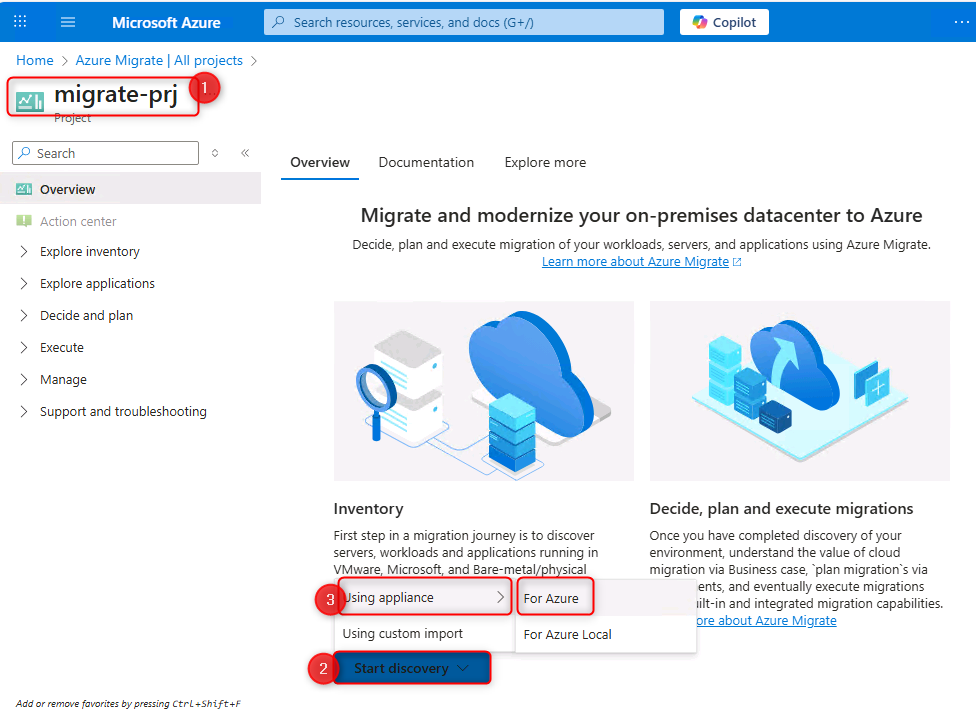
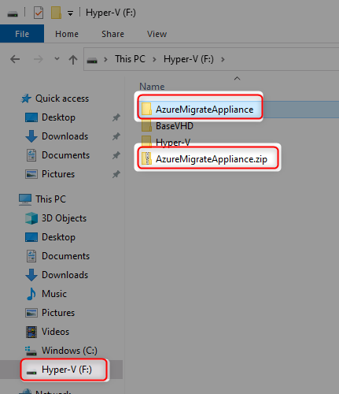
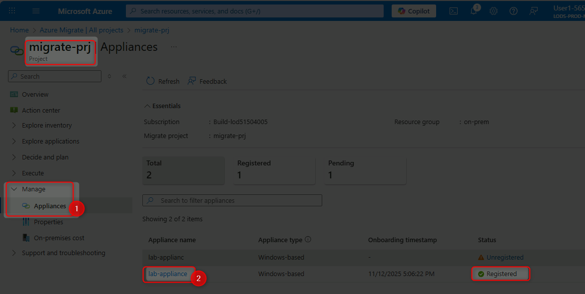
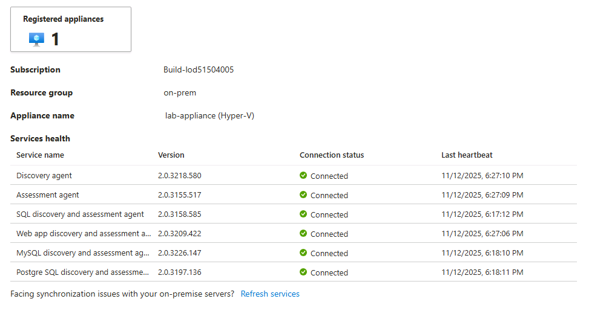

# Prepare a Migration Environment

## Goal

Set up Azure Migrate to discover and assess your on-premises infrastructure. You'll install and configure an appliance that collects data about your servers, applications, and dependencies.

## Actions

**Understand Your Environment:**
1. Access the Azure Portal using the provided credentials
2. Navigate to the `on-prem` resource group
3. Connect to the Hyper-V host VM (`lab@lab.LabInstance.Id-vm`)
4. Explore the nested VMs running inside the host

5. Verify that applications are running (e.g., http://172.100.2.110)

**Create Azure Migrate Project:**  

6. Create a new Azure Migrate project in the Azure Portal
7. Name your project (e.g., `migrate-prj`)
8. Select an appropriate region (e.g., Canada)

**Deploy the Azure Migrate Appliance:**

9. Generate a project key for the appliance
10. Download the Azure Migrate appliance VHD file

11. Extract the VHD inside your Hyper-V host (F: drive recommended)

12. Create a new Hyper-V VM using the extracted VHD:
    - Name: `AZMAppliance`
    - Generation: 1
    - RAM: 16384 MB
    - Network: NestedSwitch

13. Start the appliance VM

**Configure the Appliance:**

14. Accept license terms and set appliance password: `Demo!pass123`

15. Wait for Azure Migrate Appliance Configuration to load in browser

16. Paste and verify your project key
17. Login to Azure through the appliance interface

18. Add Hyper-V host credentials (username: `adminuser`, password: `demo!pass123`)

19. Add discovery source with Hyper-V host IP: `172.100.2.1`

20. Add credentials for Windows, Linux, SQL Server, and PostgreSQL workloads

21. Start the discovery process

## Success Criteria

- ✅ You have successfully connected to the Hyper-V host VM
- ✅ You can access nested VMs and verify applications are running
- ✅ Azure Migrate project has been created
- ✅ Appliance is deployed and connected to Azure Migrate

- ✅ All appliance services show as running in Azure Portal

- ✅ Discovery process has started collecting data from your environment

## Learning Resources

- [Azure Migrate Overview](https://learn.microsoft.com/azure/migrate/migrate-services-overview)
- [Azure Migrate Appliance Architecture](https://learn.microsoft.com/azure/migrate/migrate-appliance-architecture)
- [Hyper-V Discovery with Azure Migrate](https://learn.microsoft.com/azure/migrate/tutorial-discover-hyper-v)
- [Azure Migrate Discovery Best Practices](https://learn.microsoft.com/azure/migrate/best-practices-assessment)
