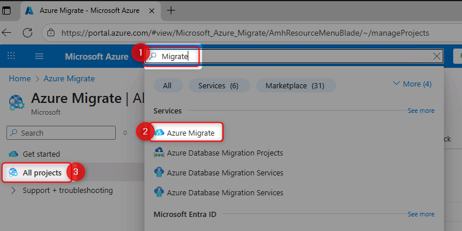
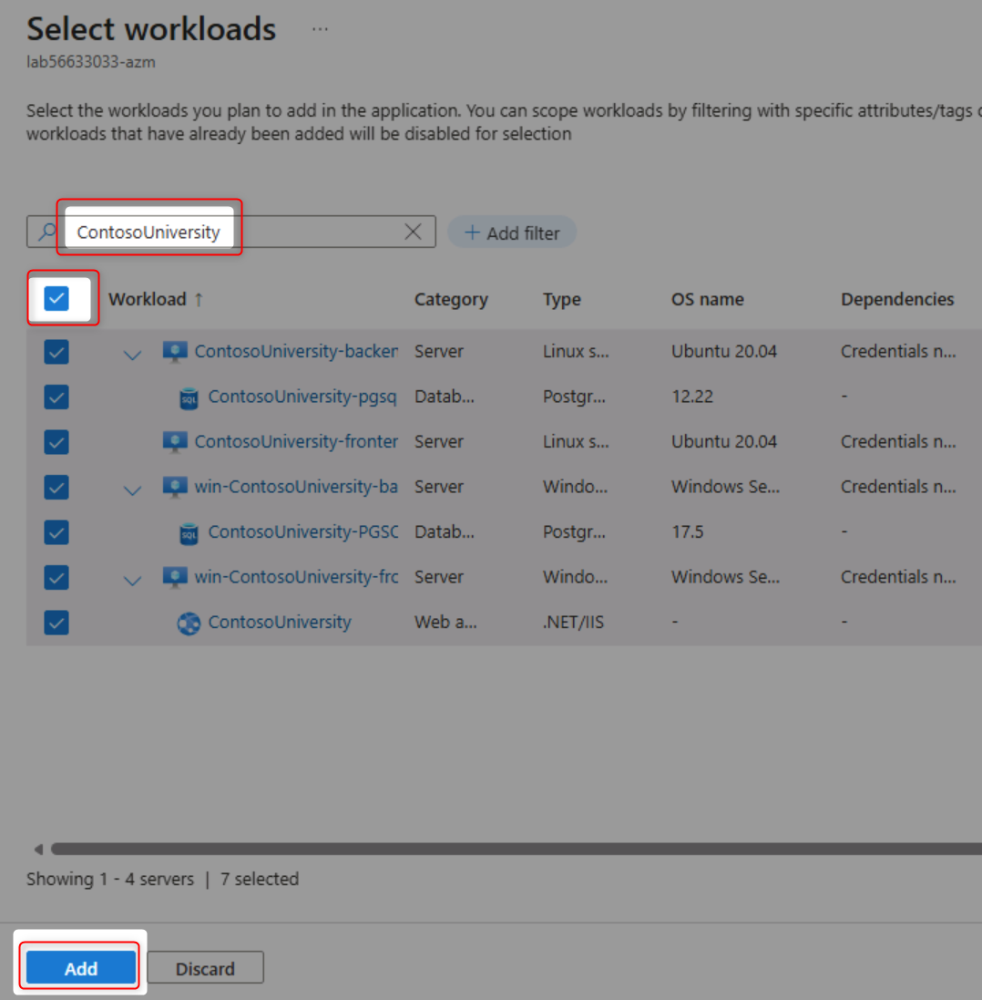
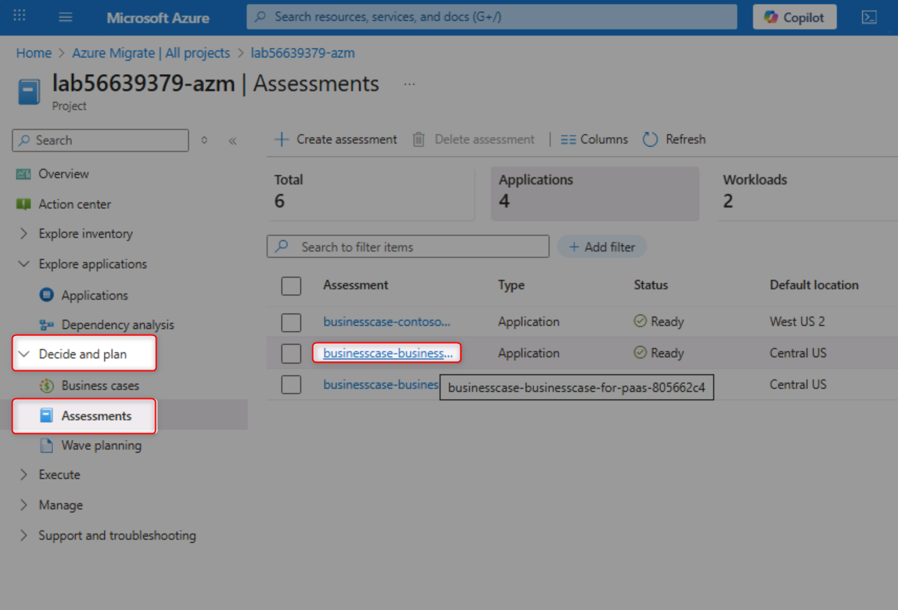
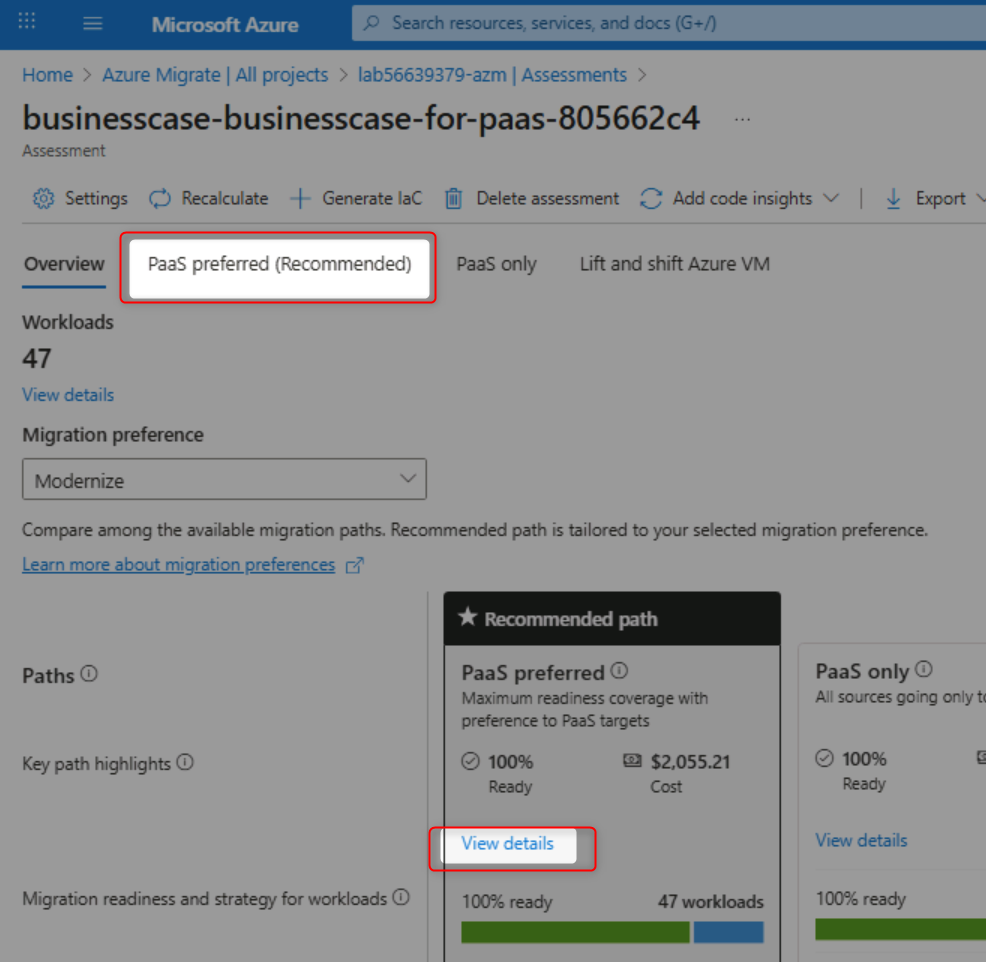
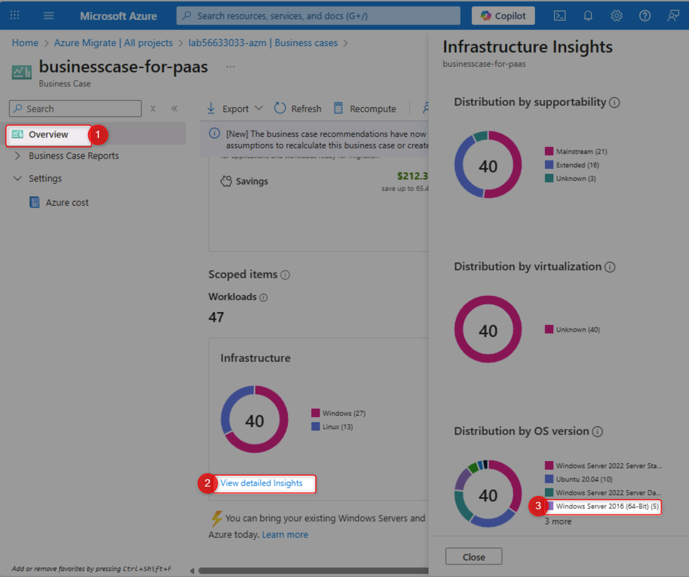

# Analyze Migration Data and Build a Business Case

## Goal

Transform raw discovery data into actionable insights by cleaning data, grouping workloads, creating business cases, and performing technical assessments to guide migration decisions.

## Actions

**Review Data Quality:**
1. Navigate to your Azure Migrate project overview

2. Open the Action Center to identify data quality issues

3. Review common issues (powered-off VMs, connection failures, missing performance data)
4. Understand the impact of data quality on assessment accuracy

**Group Workloads into Applications:**

5. Navigate to Applications page under "Explore applications"
6. Create a new application definition for "ContosoUniversity"
7. Set application type as "Custom" (source code available)
8. Link relevant workloads to the application
9. Filter and select all ContosoUniversity-related workloads

10. Set criticality and complexity ratings

**Build a Business Case:**

11. Navigate to Business Cases section
12. Create a new business case named "contosouniversity"
13. Select "Selected Scope" and add ContosoUniversity application
14. Choose target region: West US 2
15. Configure Azure discount: 15%
16. Build the business case and wait for calculations

**Analyze an Existing Business Case:**

17. Open the pre-built "businesscase-for-paas" business case
18. Review annual cost savings and infrastructure scope
19. Examine current on-premises vs future Azure costs
20. Analyze CO₂ emissions reduction estimates
21. Review migration strategy recommendations (Rehost, Replatform, Refactor)
22. Examine Azure cost assumptions and settings

**Perform Technical Assessments:**

23. Navigate to Assessments section

24. Open the "businesscase-businesscase-for-paas" assessment

25. Review recommended migration paths (PaaS preferred)
26. Analyze monthly costs by migration approach
27. Review Web Apps to App Service assessment details
28. Identify "Ready with conditions" applications
29. Review ContosoUniversity application details
30. Check server operating system support status
31. Identify out-of-support and extended support components
32. Review PostgreSQL database version information
33. Examine software inventory on each server

**Complete Knowledge Checks:**

34. Find the count of powered-off Linux VMs

35. Count Windows Server 2016 instances

36. Calculate VM costs for the ContosoUniversity application

37. Identify annual cost savings from the business case
38. Determine security cost savings

## Success Criteria

- ✅ You understand data quality issues and their impact on assessments
- ✅ Applications are properly grouped with related workloads
- ✅ Business case successfully created showing cost analysis and ROI
- ✅ You can navigate between business cases and technical assessments
- ✅ Migration strategies (Rehost, Replatform, Refactor) are clearly understood
- ✅ Application readiness status is evaluated for cloud migration
- ✅ Out-of-support components are identified for remediation
- ✅ You can answer specific questions about your environment using Azure Migrate data

## Learning Resources

- [Azure Migrate Business Case Overview](https://learn.microsoft.com/azure/migrate/concepts-business-case-calculation)
- [Azure Assessment Best Practices](https://learn.microsoft.com/azure/migrate/best-practices-assessment)
- [Application Discovery and Grouping](https://learn.microsoft.com/azure/migrate/how-to-create-group-machine-dependencies)
- [Migration Strategies: 6 Rs Explained](https://learn.microsoft.com/azure/cloud-adoption-framework/migrate/azure-best-practices/contoso-migration-refactor-web-app-sql)
